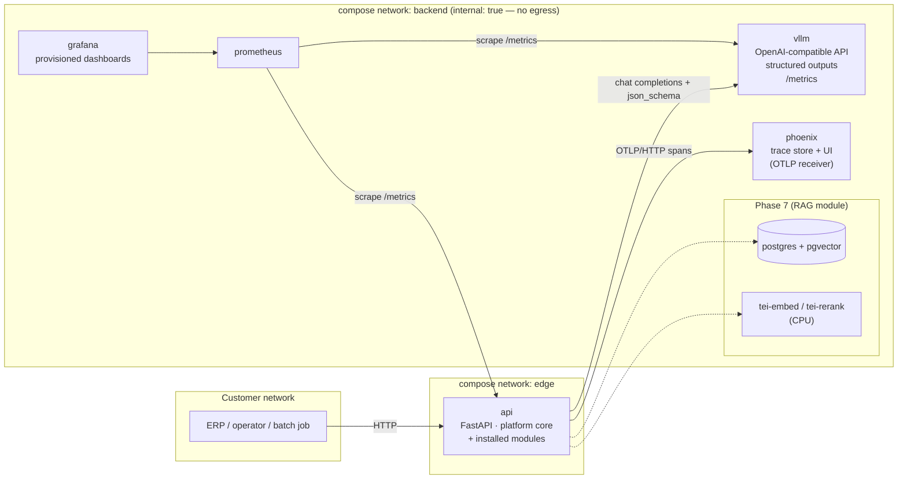
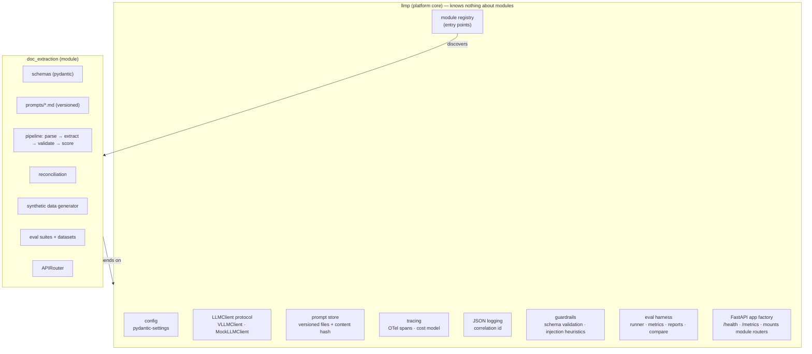
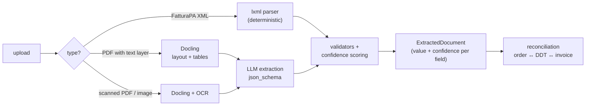

# Architecture

On-premise LLM platform for Italian SMEs (PMI). Data never leaves the customer's server:
no managed cloud services, no outbound network calls at runtime. The platform is the product;
business use cases ship as **modules** that plug into it without modifying it.

Status: **approved** (2026-09-27). Dev prerequisite: WSL2 memory raised to 24 GB via
`%UserProfile%\.wslconfig` (`[wsl2]` → `memory=24GB`).

---

## 1. Component diagram



Compose profiles:

| Profile         | Services                              | Purpose                                              |
|-----------------|---------------------------------------|------------------------------------------------------|
| *(none)* / `dev`| `api` (with `LLM_BACKEND=mock`)       | Runs anywhere, no GPU. Used by CI and quick dev loop. |
| `gpu`           | `vllm`                                | Real serving on the NVIDIA GPU.                      |
| `observability` | `phoenix`, `prometheus`, `grafana`    | Tracing UI, metrics, dashboards.                     |

`make up` = `dev + gpu + observability`. Every service is pinned by digest/version.

### Inside the `api` process



---

## 2. Key decisions

### 2.1 Serving: vLLM 0.30.0, official image, on sm_120

**Verified on this machine (2026-09-27):**

| Item | Value | Source |
|---|---|---|
| GPU | RTX 5070 Laptop, 8151 MiB, compute capability **12.0** (sm_120) | `nvidia-smi` inside a container |
| Driver | 596.21 (Windows host), max CUDA **13.2** | `nvidia-smi` |
| Docker GPU passthrough | works (`docker run --gpus all` sees the GPU) | tested |
| vLLM latest stable | **v0.30.0** (2026-09-22) | Docker Hub `vllm/vllm-openai` tags, PyPI |
| Image CUDA | 13.0.3 (default tag), `-cu129` variant also published | upstream `docker/Dockerfile` |
| Image arch list | `TORCH_CUDA_ARCH_LIST='7.5 8.0 8.6 8.9 9.0 10.0 11.0 12.0'` → **sm_120 kernels are compiled in** | upstream `docker/Dockerfile` |

Conclusion: **the official `vllm/vllm-openai:v0.30.0` image is expected to work; no custom build.**
Driver 596 supports CUDA 13.0 user-space, so the default (cu130) tag is used. Community reports of
needing `TORCH_CUDA_ARCH_LIST=12.0` refer to source/pip builds, not the official image. What is
*not* yet verified — and is the first gate of Phase 1 — is runtime behaviour of the specific
kernels we need on sm_120: AWQ/Marlin W4A16 GEMM, the attention backend (FlashAttention 3 is
Hopper-only; FA2/FlashInfer/Triton are used on sm_120), Triton kernels for Qwen3.5 linear
attention, and FP8 KV cache. Fallback if one fails: `-cu129` tag, then pinning the attention
backend via `VLLM_ATTENTION_BACKEND`, then a nightly. No custom build unless all fail.

Why vLLM over alternatives: llama.cpp/Ollama are excellent single-user runtimes but have weaker
continuous batching and structured-output guarantees; SGLang is comparable but vLLM has the larger
Prometheus metric surface and a built-in benchmark tool (`vllm bench serve`) that we reuse for
load testing. TGI is in maintenance mode.

Structured output: OpenAI `response_format={"type":"json_schema", ...}`, schema generated from
the pydantic model; vLLM's default grammar backend (xgrammar) enforces it at decode time. The
output is **still** re-validated with pydantic (grammar guarantees syntax + schema shape, not
business validity).

WSL2 note: the docs target a Linux server; WSL2 is the dev environment only. Nothing in the
stack depends on WSL.

### 2.2 Model candidates (all Apache-2.0 or commercially usable)

Budget: 8151 MiB physical. With `gpu_memory_utilization=0.90` vLLM may use ~7.2 GiB; subtract
weights, then ~0.6–0.9 GiB for activations + CUDA graphs; the rest is KV cache.

KV cache per token = 2 (K,V) × full-attention layers × KV heads × head_dim × bytes.

| # | Model | Arch | 4-bit weights on disk | KV / token (bf16 → fp8) | Headroom for KV | Proposed vLLM params |
|---|---|---|---|---|---|---|
| **A (primary)** | **Qwen3.5-4B** (`cyankiwi/Qwen3.5-4B-AWQ-4bit`, community AWQ W4A16) | hybrid: 8 full-attn + 24 Gated-DeltaNet layers, 4 KV heads × 256 | **4.0 GB** | 2·8·4·256·2 = **32 KiB → 16 KiB**; plus ~25 MiB fixed recurrent state per sequence | ~2.3 GiB → ~70k tokens in bf16 | `max_model_len=16384`, `gpu_memory_utilization=0.90`, `max_num_seqs=8`, `kv_cache_dtype=auto`, `limit_mm_per_prompt={"image":0,"video":0}` |
| B | **Qwen3-8B-AWQ** (`Qwen/Qwen3-8B-AWQ`, **official** quant) | dense, 36 layers, 8 KV heads × 128 | **6.1 GB** | 2·36·8·128·2 = **144 KiB → 72 KiB** | ~0.6–0.9 GiB → ~9–12k tokens in fp8 | `max_model_len=6144`, `gpu_memory_utilization=0.92`, `max_num_seqs=2`, `kv_cache_dtype=fp8`, thinking disabled via chat template kwargs |
| C | **Llama-3.1-8B-Instruct AWQ** (`hugging-quants/...-AWQ-INT4`) | dense, 32 layers, 8 KV heads × 128 | ~5.7 GB | **128 KiB → 64 KiB** | ~1.0 GiB fp8 → ~16k tokens | `max_model_len=6144`, `gpu_memory_utilization=0.92`, `max_num_seqs=2`, `kv_cache_dtype=fp8` |

Why A is primary: the hybrid architecture makes KV cache ~5–9× cheaper than a dense 8B, which on
8 GB is the binding constraint — it buys real concurrency and room for a full invoice + few-shot
examples. Qwen3.5 is also natively multimodal, which opens a later experiment (VLM on page
images instead of OCR) with the same weights. Risk: the 4-bit build is a community quant. Mitigation:
Phase 1 measures it against B; if quality is off, we quantize ourselves with `llm-compressor`
(offline, reproducible script) rather than trust a random checkpoint.

Why B is kept: official quant of a well-known dense model — the "safe" baseline for the A/B report.
C is a family-diversity check; its licence (Llama 3.1 Community) permits commercial use but adds
attribution/AUP obligations, so it is not a default for customer deployments.

Rejected: **Qwen3.5-9B** — 4-bit checkpoints are 9–12 GB on disk (unquantized vision tower and
248k-token embeddings): does not fit. **Ministral-3-8B** — Apache-2.0, but no usable 4-bit build
(the published "AWQ" is 14 GB). **Granite 4.x 8B** — Apache-2.0 but no official 4-bit build and
weaker Italian evidence. FP8 weights (native on Blackwell) — an 8B in FP8 is ~9 GB: does not fit.

All numbers above are estimates from `config.json`. **Measured values (Phase 1) are in
`docs/benchmarks/serving.md`**: under WSL2 only ~6.8 GiB are usable, so presets use
`gpu-memory-utilization: 0.85`; A fits with 56k KV tokens, B only with a fixed 0.5 GiB KV budget.

### 2.3 Platform/module boundary

- **uv workspace** with two kinds of member: `packages/platform` (import name `llmp`) and
  `modules/<name>`. Each has its own `pyproject.toml`. Non-obvious reason: heavy module
  dependencies (Docling pulls torch CPU, ~1.5 GB) stay out of the platform's dependency set, and
  the platform package physically cannot declare a dependency on a module.
- Modules register via Python **entry points** (`[project.entry-points."llmp.modules"]`). The
  platform discovers installed modules at startup; adding a module = adding a workspace member.
  No platform file changes.
- The boundary is enforced in CI by `import-linter` (contract: `llmp` must not import any module).
- A module implements one small protocol:

  ```python
  class Module(Protocol):
      name: str

      def router(self, ctx: PlatformContext) -> APIRouter: ...
      def eval_suites(self) -> Sequence[EvalSuite]: ...
  ```
  `PlatformContext` hands the module the (traced) LLM client and settings. Modules never build
  an LLM client themselves, so tracing/guardrails cannot be bypassed accidentally. Modules load
  their own prompt files with the platform's `PromptStore`.

### 2.4 LLM client

```python
class LLMClient(Protocol):
    async def complete(self, request: LLMRequest) -> LLMResponse: ...
```
`LLMRequest` carries messages, the prompt reference (id + version + hash), optional pydantic
output model, sampling params. `LLMResponse` carries text, model, token usage, latency, and
`parse(Model)` validates the text against a pydantic model. Logprobs are added only if confidence
scoring needs them (§2.9). Tracing is a **decorator around the protocol**, not inside each implementation.

- `VLLMClient`: `httpx.AsyncClient` against `/v1/chat/completions`. The `openai` SDK is not used:
  one endpoint does not justify the dependency, and vLLM-specific fields (e.g. structured-output
  options) are easier to pass raw.
- `MockLLMClient`, deterministic, two modes:
  - `replay`: responses recorded from real vLLM runs, stored as JSON "cassettes" keyed by
    `sha256(model, prompt hash, rendered messages, params)`. CI evals replay real model outputs, so
    CI metrics are meaningful and catch regressions in parsing, post-processing and scoring.
    A cassette miss fails loudly with "re-record with `make eval-record`".
  - `schema`: returns a deterministic, schema-valid instance of the output model (seeded). For unit
    tests of plumbing only; never used to produce metrics.

### 2.5 Prompts

Plain files `modules/<m>/src/<m>/prompts/<prompt_id>/v<N>.md` with `string.Template`
placeholders (no Jinja: we have no need for logic in templates). The store computes a content
hash; every trace and eval report records `prompt_id`, `version` and `hash`, so an edited-in-place
prompt is detectable. New behaviour = new version file, old versions kept for A/B.

### 2.6 Observability

**Tracing: Arize Phoenix (self-hosted, single container) — chosen over Langfuse.**

| | Langfuse v3 (self-hosted) | Phoenix |
|---|---|---|
| Containers | web, worker, Postgres, ClickHouse, Redis/Valkey, MinIO (6) | 1 (SQLite volume, or Postgres) |
| Documented minimums | web 4 GiB, ClickHouse 8 GiB, MinIO 4 GiB, Redis 1.5 GiB (+ worker, Postgres) → **~18 GiB** | < 1 GiB in practice at our volumes |
| Ingestion | OTLP + SDK | OTLP (OpenInference conventions) |
| Licence | MIT (core) | Elastic License 2.0 |
| Prompt mgmt / datasets UI | richer | adequate |

The dev machine exposes **15 GiB RAM to WSL2** (default 50% of host), while vLLM (~3–4 GiB host
RAM), Docling (~2–3 GiB) and the API also have to run. Langfuse's documented minimums alone
exceed the budget; even with `.wslconfig` raised to 24 GiB it would crowd out the workload we are
trying to observe. For a PMI server it also means 5 extra stateful services to operate and back up.

Licence note: ELv2 allows self-hosting at a customer and internal use; it forbids offering Phoenix
itself as a managed service. That is compatible with this project; flagged for awareness.

**Lock-in avoidance**: the platform emits plain OpenTelemetry spans (OpenInference attribute names
set by hand: `llm.model_name`, `llm.token_count.prompt`, … plus our own `prompt.id`,
`prompt.version`, `prompt.hash`, `cost.eur`). Switching to Langfuse later = change the OTLP
endpoint. We do not use Phoenix's SDK or auto-instrumentors.

**Cost model** (on-prem has no per-token price): configured `gpu_hour_cost_eur` (amortized
hardware + power), converted to €/1M input and output tokens using throughput measured by the
Phase 6 load test and stored in config. Cost per document = Σ tokens × price. Documented as an
estimate; lets the README compare against cloud API pricing.

**Metrics**: Prometheus scrapes vLLM `/metrics` and API `/metrics` (`prometheus-client`).
Grafana is provisioned from files (datasource + dashboard JSON in the repo): throughput
(prompt/generation tokens/s), TTFT p50/p95, e2e latency p50/p95, KV-cache usage %, running vs
waiting requests, plus API-level documents/s and per-stage latency. Metric names are verified
against the pinned vLLM version in Phase 6 (they changed across the V0→V1 engine transition).

**Logs**: stdlib `logging` with a ~30-line JSON formatter (no structlog: not needed). A middleware
sets a correlation id (from `X-Request-ID` or generated) in a `contextvar`; every log line carries
`correlation_id` and the current OTel `trace_id`, so a log line links to its Phoenix trace.

### 2.7 Evaluation harness (platform-level)

- A module declares `EvalSuite`s (`llmp.eval.suite`): a dataset split and
  `run_case(split, case_id, ctx) -> CaseResult`, which runs the real pipeline and scores it as
  per-field TP/FP/FN counts plus per-case scores. The platform runner handles concurrency,
  latency, errors (recorded, and scored as 0), micro/per-field P/R/F1 and report metadata.
- Datasets live in the repo, versioned by directory (`evals/datasets/<name>/v<N>/<split>/`) with a
  `manifest.json` (seed, SHA-256 of every generated file). **Committed: ground truth
  (`truth.json`), manifests and a contact sheet — not the documents.** PDFs, scans and XML are
  regenerated deterministically (`make synth`); CI regenerates the `ci` split and fails on any
  byte difference, so a generator change forces a new dataset version. (Committing the scans
  would have meant ~18 MB of binaries per version.)
- A run writes `evals/runs/<ts>_<suite>/report.json`: git sha, model, vLLM params, prompt
  versions+hashes, dataset version, per-item results, aggregates, latency/cost. `runs/` is
  gitignored; chosen runs are promoted to `evals/baselines/`.
- `make eval-compare A=<report> B=<report>` prints a markdown diff table (model A vs B, prompt v1
  vs v2). CI replays cassettes and fails if any gated metric drops below baseline − tolerance.

### 2.8 Guardrails and security

- **Output validation**: grammar-constrained decoding + pydantic re-validation + domain validators
  (P.IVA checksum, date sanity, Σ lines = imponibile, imposta = imponibile × aliquota within
  rounding). Failures lower confidence and are surfaced, never silently "fixed".
- **Prompt injection**: documents are untrusted input. The extraction pipeline has **no tools and
  no side effects** — the worst an injection can do is corrupt field values, which the arithmetic
  and grounding checks are designed to catch. A dedicated suite of adversarial synthetic
  documents (hidden white/tiny text in PDFs, text outside the crop box, instructions in PDF
  metadata, instructions inside FatturaPA free-text fields such as `Causale`/`Descrizione`, OCR-
  visible instructions on scans) measures **attack success rate** per attack type. For native
  PDFs, a hidden-text detector compares the text layer to what is visible on the rendered page.
- **Tool allowlist**: implemented with the first agentic component (RAG module, Phase 7): tools
  are registered per module and an agent loop can only call tools on its module's allowlist,
  with argument schemas validated. Not built before there is a consumer.
- **Secrets**: none in the repo. `pydantic-settings` reads env / `.env` (gitignored,
  `.env.example` committed). `gitleaks` runs in CI.
- **No egress**: runtime services sit on a compose network with `internal: true`. An automated
  check asserts `vllm` cannot reach the internet. Telemetry is disabled everywhere
  (`VLLM_NO_USAGE_STATS=1`, `DO_NOT_TRACK=1`, `HF_HUB_OFFLINE=1`, Grafana analytics off, Phoenix
  telemetry off). Models are downloaded once by `make models` (install time) into a volume;
  Docling models are baked into the API image at build time.

### 2.9 Document extraction module



- **FatturaPA XML is parsed deterministically**, not by the LLM. It is already structured data;
  using an LLM there would add cost, latency and error for zero benefit, and a reviewer would
  rightly flag it. The XML path still produces the same `Document` (confidence 1.0) so
  reconciliation and eval treat all sources uniformly. Target: FatturaPA **FPR12 1.2.3** (B2B
  schema, valid since 2025-04-01, spec v1.4), vendored with its `xmldsig` import rewritten to a
  local path. The parser never loads DTDs or entities and rejects any document declaring a
  DOCTYPE (FatturaPA has none; a DTD only serves XXE / entity-expansion attacks).
- **Docling** (MIT, IBM) for PDFs: one tool for native and scanned PDFs, layout analysis and
  TableFormer table structure (invoice line items *are* tables), runs on CPU, models can be
  pre-fetched for offline use. Alternatives rejected: PyMuPDF (AGPL — problematic for a product
  deployed at customers), pdfplumber (native only, no OCR, no layout model), raw Tesseract (no
  table structure), cloud OCR (violates the constraints). OCR engine (Docling's default vs
  Tesseract `ita`) is chosen in Phase 3c by measurement.
- **Confidence per field**, in increasing cost order; we stop when calibration is good enough
  (measured as expected calibration error on the eval set):
  1. validators (checksum, arithmetic, format) and **grounding** (normalized value found in the
     source text);
  2. OCR confidence of the source span (scans);
  3. token logprobs of the value span from vLLM (only if 1–2 are poorly calibrated).
- **Reconciliation is deterministic** first: link documents by references (invoice `DatiDDT` /
  `DatiOrdineAcquisto`, DDT → order number), match lines by article code, then by normalized
  description similarity (stdlib `difflib`), then compare quantity, unit price, VAT rate, totals.
  Discrepancy types are an enum (`qty_mismatch`, `price_mismatch`, `missing_line`, `extra_line`,
  `vat_mismatch`, `total_mismatch`, `unlinked_document`). An LLM is added for ambiguous line
  matching **only if** measurement shows the deterministic matcher fails on realistic synthetic
  descriptions. Eval line alignment uses the same idea (code → exact description → most similar
  description), greedy rather than optimal assignment, so no scipy.
- **Synthetic data generator**: seeded, produces coherent order → DDT → invoice chains for
  fictitious Italian companies (valid P.IVA check digits, realistic addresses/products/VAT rates),
  FatturaPA XML validated against the XSD, native PDFs (reportlab, `invariant=1` for byte-stable
  output), degraded scans (rasterize with pypdfium2 → rotation, blur, noise, JPEG artefacts with
  Pillow/numpy), injected discrepancies and injection attacks, each with ground-truth JSON.
- **Metrics**: per-field precision/recall/F1 after normalization (ISO dates, amounts as `Decimal`
  cents, P.IVA without `IT`), line items aligned by optimal assignment before scoring;
  discrepancy detection P/R/F1 per type; latency and € per document; batch throughput.

### 2.10 Retrieval (designed now, built in Phase 7 with the RAG module)

- **pgvector over Qdrant**: the RAG module needs Postgres anyway (documents, chunks, metadata,
  citations), and Postgres gives Italian full-text search (`tsvector` with `italian` config) for
  hybrid retrieval in the same query. A PMI corpus of circolari is 10³–10⁵ chunks, far below where
  Qdrant's advantages (filtered ANN at 10⁷+, quantization, sharding) matter. One fewer service to
  operate and back up at the customer.
- **Embeddings + reranker on CPU** via Hugging Face `text-embeddings-inference` CPU image:
  `BAAI/bge-m3` (MIT, multilingual, 1024-d) and `BAAI/bge-reranker-v2-m3` (Apache-2.0). VRAM is
  reserved for the generator.
- Not built earlier because the extraction module has no retrieval need; building it first would
  be speculative infrastructure.

### 2.11 Demo UI (Phase 5)

Server-rendered pages owned by the `doc_extraction` module (Jinja2 + htmx served as a vendored
static file): upload documents, see extracted fields with confidence, discrepancies, and links
to Phoenix traces. Chosen over a SPA because it needs no build toolchain or extra container and
works offline; it is a demo surface, not a product UI (no auth, localhost only).

---

## 3. Repository layout

```
.
├── packages/platform/            # llmp — platform core
│   └── src/llmp/{config,modules,llm,prompts,tracing,logging,guardrails,eval,api}/
├── modules/doc_extraction/       # first module
│   ├── src/doc_extraction/{schemas,prompts,parsing,pipeline,reconciliation,synth,module}/
│   ├── evals/{datasets,cassettes,baselines}/
│   └── tests/
├── deploy/
│   ├── compose.yaml
│   ├── api.Dockerfile
│   ├── prometheus/prometheus.yml
│   └── grafana/{provisioning,dashboards}/
├── loadtest/                     # locustfile + vllm bench scripts
├── docs/
├── Makefile
└── pyproject.toml                # uv workspace root, ruff/mypy/pytest config
```

## 4. Dependency ledger

Every runtime dependency must appear here with a reason. (Dev tools: ruff, mypy, pytest,
pytest-asyncio, import-linter, locust, gitleaks-in-CI.)

| Dependency | Where | Why |
|---|---|---|
| fastapi, uvicorn | platform | required HTTP stack |
| pydantic v2, pydantic-settings | platform | schemas, config (required) |
| httpx | platform | async HTTP to vLLM (replaces `openai` SDK) |
| opentelemetry-sdk, -exporter-otlp-proto-http | platform | vendor-neutral tracing to Phoenix |
| prometheus-client | platform | API metrics endpoint |
| lxml | doc_extraction | FatturaPA parsing + XSD validation |
| docling | doc_extraction | PDF layout/table/OCR (§2.9) |
| jinja2 | doc_extraction (UI) | server-rendered demo pages (§2.11) |
| reportlab | doc_extraction (synth) | PDF generation (BSD) |
| pypdfium2, Pillow | doc_extraction (synth) | rasterize + degrade scans (also used by docling) |
| numpy | doc_extraction (synth) | scan noise; already a transitive dependency of the PDF stack |

## 5. Rejected alternatives (summary)

| Rejected | In favour of | Reason |
|---|---|---|
| LangChain / LlamaIndex | hand-written thin layer | requirement; also fewer moving parts to audit on-prem |
| Langfuse | Phoenix | RAM (15 GiB WSL budget), 6 services vs 1 |
| Qdrant | pgvector | one service fewer; scale does not need it |
| llama.cpp / Ollama | vLLM | batching, structured outputs, metrics |
| `openai` SDK | httpx | single endpoint, raw vLLM fields |
| Jinja2 prompts | `string.Template` | no template logic needed |
| structlog | stdlib logging + JSON formatter | ~30 lines |
| PyMuPDF | Docling / pypdfium2 | AGPL licence |
| LLM on FatturaPA XML | lxml | deterministic data needs no model |
| k6 | `vllm bench serve` + locust | vLLM's own tool measures TTFT/ITL correctly; locust reuses Python payload code for app-level tests |
